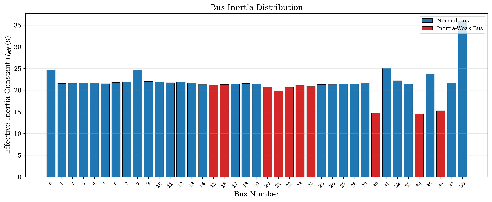
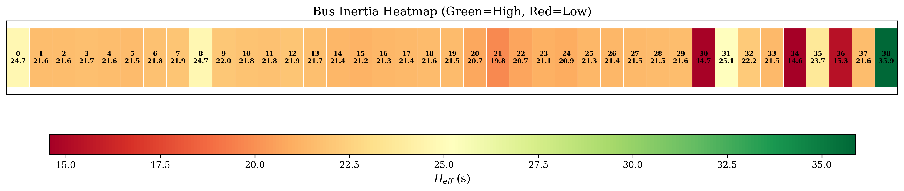
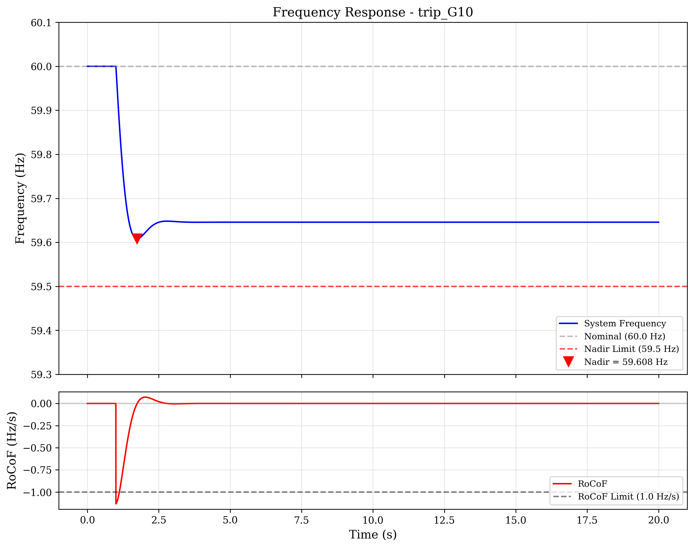
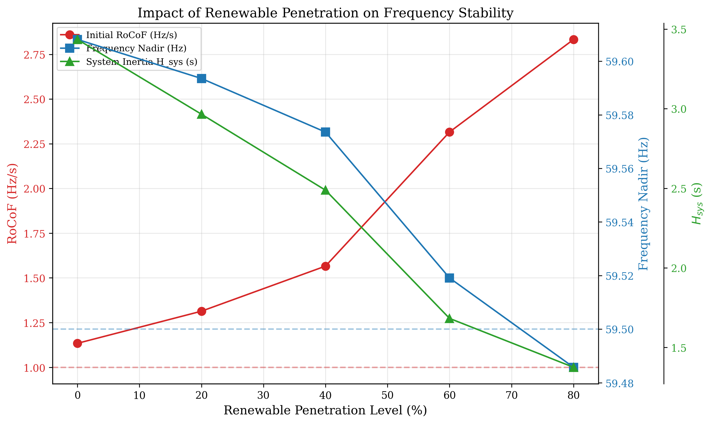
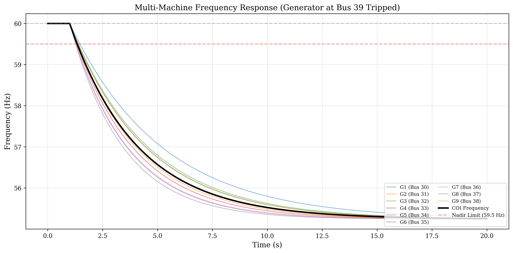

# Bus Inertia Analysis on IEEE 39-Bus New England System

A research-quality Python program for analyzing **bus-level inertia distribution** in power systems under increasing renewable energy penetration. This study quantifies how replacing synchronous generators with inverter-based resources (IBRs) degrades system inertia, increases Rate of Change of Frequency (RoCoF), and threatens frequency stability.

## Background

As renewable energy sources (wind, solar) replace conventional synchronous generators, the rotational inertia of power systems decreases. Unlike synchronous machines, inverter-based resources provide **zero rotational inertia** by default, making the system more vulnerable to frequency disturbances. This program analyzes:

- **Where** inertia is distributed across the network (bus-level analysis)
- **How much** inertia is lost under different renewable penetration levels
- **What happens** to frequency stability when generators trip

## System Under Study

**IEEE 39-Bus New England System** (10 generators, 39 buses)

| Bus | Generator | H (s) | Rating (MVA) | Kinetic Energy (MWs) |
|-----|-----------|--------|-------------|---------------------|
| 30  | G1        | 4.20   | 350         | 1,470               |
| 31  | G2        | 3.03   | 830         | 2,515               |
| 32  | G3        | 3.58   | 620         | 2,220               |
| 33  | G4        | 2.86   | 750         | 2,145               |
| 34  | G5        | 2.60   | 560         | 1,456               |
| 35  | G6        | 3.48   | 680         | 2,366               |
| 36  | G7        | 2.64   | 580         | 1,531               |
| 37  | G8        | 2.43   | 890         | 2,163               |
| 38  | G9        | 3.45   | 1,040       | 3,588               |
| 39  | G10       | 5.00   | 1,400       | 7,000               |

- **System Inertia (COI):** H_sys = 3.436 s
- **Total Kinetic Energy:** 26,454 MWs
- **Total Generation Capacity:** 7,700 MVA

## Methodology

### 1. Bus-Level Inertia Distribution

The effective inertia at each bus is computed using **electrical distance weighting** from the bus impedance matrix:

```
H_eff(k) = sum_i [ w_ki * H_i * S_i ] / S_base
```

where `w_ki = (1/d_ki) / sum_j(1/d_kj)` and `d_ki` is the electrical distance between bus k and generator i, derived from `Z_bus = inv(Y_bus)`.

### 2. Frequency Response Simulation

The aggregated swing equation with governor response:

```
2 * H_sys * d(delta_f)/dt = -(P_loss/S_total) - D * delta_f + P_gov
d(P_gov)/dt = (1/T_gov) * (-delta_f/R - P_gov)
```

Analytical initial RoCoF:

```
RoCoF = -P_loss_MW * f_0 / (2 * sum(H_i * S_i))
```

### 3. Renewable Penetration Scenarios

Synchronous generators are progressively replaced with IBRs (H=0) in order of smallest inertia constant first: G8, G5, G7, G4, G2, G3, G6, G1, G9, G10.

## Results

### Study 1: Bus Inertia Distribution (Base Case)





**Key findings:**
- Bus 38 (near G9, 1040 MVA) has the highest effective inertia: H_eff = 35.88 s
- Bus 34 (G5, 560 MVA) has the lowest: H_eff = 14.56 s
- **10 inertia-weak buses** identified (bottom 25th percentile): Buses 34, 30, 36, 21, 22, 20, 24, 23, 15, 16
- Generator buses with small-rated machines (G5, G1, G7) are the most inertia-weak

### Study 2: Frequency Response After Generator Trip



| Scenario | Power Loss (MW) | RoCoF (Hz/s) | Nadir (Hz) | RoCoF OK | Nadir OK |
|----------|----------------|---------------|------------|----------|----------|
| Trip G8  | 540            | -0.612        | 59.788     | YES      | YES      |
| Trip G10 | 1,000          | -1.134        | 59.608     | **NO**   | YES      |
| Trip G2  | 573            | -0.650        | 59.776     | YES      | YES      |

**Key findings:**
- The largest generator trip (G10, 1000 MW) exceeds the RoCoF limit of 1.0 Hz/s
- All scenarios maintain frequency nadir above the 59.5 Hz threshold in the base case
- Analytical and simulated RoCoF values match within 0.2%

### Study 3: Impact of Renewable Penetration



| Penetration (%) | H_sys (s) | E_kinetic (MWs) | RoCoF (Hz/s) | Nadir (Hz) | Replaced Generators |
|-----------------|-----------|-----------------|--------------|------------|---------------------|
| 0               | 3.436     | 26,454          | -1.134       | 59.608     | --                  |
| 20              | 2.966     | 22,835          | -1.314       | 59.594     | G8, G5              |
| 40              | 2.488     | 19,159          | -1.566       | 59.574     | G8, G5, G7, G4      |
| 60              | 1.682     | 12,954          | -2.316       | 59.519     | G8, G5, G7, G4, G2, G3, G1 |
| **80**          | **1.375** | **10,588**      | **-2.833**   | **59.486** | G8, G5, G7, G4, G2, G3, G6, G1 |

**Key findings:**
- System inertia drops from 3.44 s (0%) to 1.38 s (80%) -- a **60% reduction**
- RoCoF degrades from -1.13 Hz/s to -2.83 Hz/s (2.5x worse)
- At **80% penetration**, the frequency nadir (59.49 Hz) **violates the 59.5 Hz limit**
- The critical penetration threshold is between 60-80%

### Study 4: Multi-Machine Frequency Dynamics



**Bus Inertia Under Different Penetration Levels:**


**Key findings:**
- Individual generators show different frequency trajectories due to varying inertia constants
- Low-H generators (G5, G7, G8) deviate faster from nominal frequency
- At 60% penetration with only 2 active synchronous generators, the system becomes critically unstable

## File Structure

```
bus_inertia_project_for_SHAKIL/
  config.py                  -- System parameters, generator data, scenarios
  ieee39_network.py          -- IEEE 39-bus model, Y/Z bus matrices, electrical distance
  inertia_distribution.py    -- Bus-level inertia computation, weak bus identification
  frequency_simulation.py    -- Swing equation simulation, RoCoF/nadir analysis
  visualization.py           -- Publication-quality figure generation
  main.py                    -- Main analysis pipeline (5 studies)
  requirements.txt           -- Python dependencies
  results/                   -- Output figures (.png) and tables (.csv)
    fig1_bus_inertia_distribution.png
    fig2_trip_G8.png / fig2_trip_G10.png / fig2_trip_G2.png
    fig3_penetration_study.png
    fig4_multi_machine_pen0.png / pen40.png / pen60.png
    fig5_inertia_comparison.png
    fig6_inertia_heatmap.png
    table1_generator_data.csv
    table2_penetration_results.csv
    table3_bus_inertia.csv
    summary.txt
```

## Usage

```bash
pip install -r requirements.txt
python main.py
```

Results are saved to `results/`.

## Dependencies

- **pandapower** >= 2.14 -- Power system modeling and IEEE test networks
- **numpy** >= 1.24 -- Numerical computation
- **scipy** >= 1.10 -- ODE solver for swing equation
- **matplotlib** >= 3.7 -- Publication-quality plotting
- **pandas** >= 2.0 -- Data tables and CSV export

## References

1. P. Kundur, *Power System Stability and Control*, McGraw-Hill, 1994.
2. A. Ulbig, T. S. Borsche, and G. Andersson, "Impact of Low Rotational Inertia on Power System Stability and Operation," *IFAC Proceedings Volumes*, vol. 47, no. 3, pp. 7290-7297, 2014.
3. F. Milano, F. Dorfler, G. Hug, D. J. Hill, and G. Verbic, "Foundations and Challenges of Low-Inertia Systems," *Proc. 20th PSCC*, 2018.
4. H. Bevrani, T. Ise, and Y. Miura, "Virtual Synchronous Generators: A Survey and New Perspectives," *Int. J. Electrical Power & Energy Systems*, vol. 54, pp. 244-254, 2014.
5. A. Fernandez-Guillamon, E. Gomez-Lazaro, E. Muljadi, and A. Molina-Garcia, "Power Systems with High Renewable Energy Sources: A Review of Inertia and Frequency Control Strategies over Time," *Renewable and Sustainable Energy Reviews*, vol. 115, 109369, 2019.
6. M. Dreidy, H. Mokhlis, and S. Mekhilef, "Inertia Response and Frequency Control Techniques for Renewable Energy Sources: A Review," *Renewable and Sustainable Energy Reviews*, vol. 69, pp. 144-155, 2017.
7. M. Tuo and X. Li, "Dynamic Estimation of Power System Inertia Distribution Using Synchrophasor Measurements," *Proc. IEEE NAPS*, 2021.
8. Z. Li, W. Ye, et al., "New Energy Power System Inertia Weak Position Evaluation and Frequency Monitoring Positioning," *Frontiers in Energy Research*, vol. 12, 2024.
