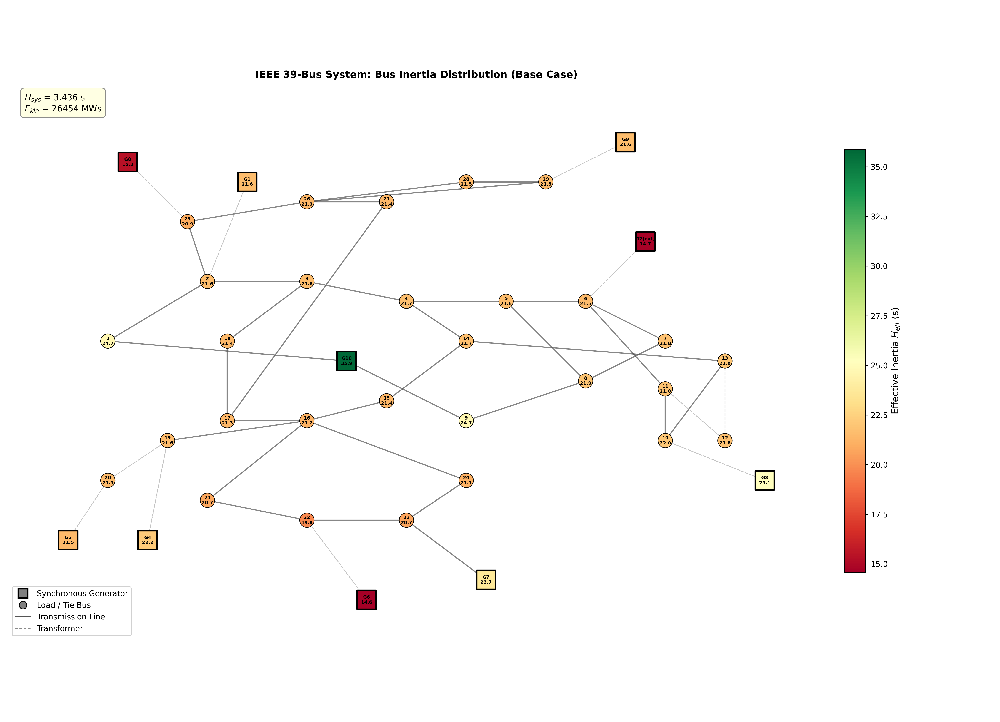
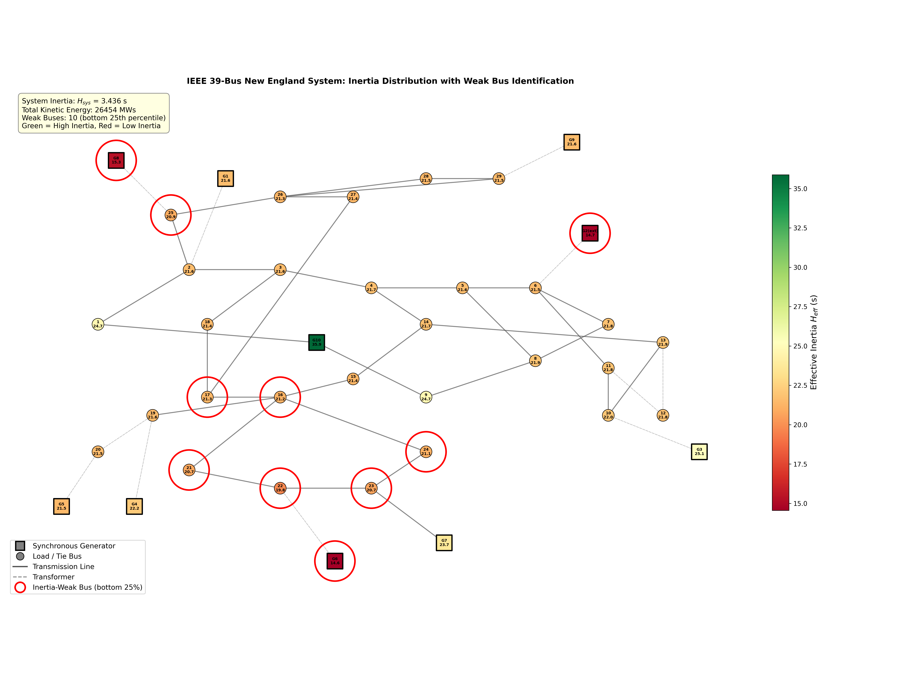
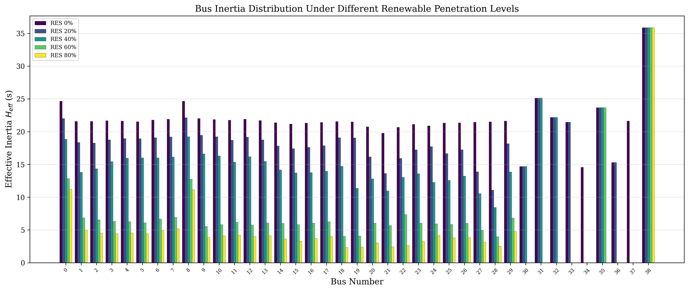

<!-- _class: title -->
<!-- _paginate: false -->

# Bus-Level Inertia Distribution Analysis in IEEE 39-Bus System
## — Under Increasing Renewable Energy Penetration —

Shakil $^{1}$, Ryuto Shigenobu $^{1}$

$^{1}$ Department of Electrical and Electronic Engineering, University of Fukui, Japan

2026

---

<!-- _class: divider -->
<!-- _paginate: false -->

# 1. Introduction

## Why Bus Inertia Matters

---

# Research Background

## The Low-Inertia Challenge

- Renewable energy sources (wind, solar) are replacing synchronous generators
- Inverter-based resources (IBRs) provide **zero rotational inertia**
- System frequency becomes more vulnerable to disturbances

## Key Question

**Where** in the network is inertia support weakest, and **how much** renewable penetration can the system tolerate before frequency stability is compromised?

---

<!-- _class: equation -->

# System Inertia Fundamentals

$$H_{\mathrm{sys}} = \frac{\displaystyle\sum_{i=1}^{N_g} H_i \cdot S_i}{\displaystyle\sum_{i=1}^{N_g} S_i}$$

| Symbol | Description |
|:------:|:------------|
| $H_i$ | Inertia constant of generator *i* (seconds) |
| $S_i$ | MVA rating of generator *i* |
| $N_g$ | Number of synchronous generators |
| $H_{\mathrm{sys}}$ | System-wide equivalent inertia (COI formulation) |

---

<!-- _class: equation -->

# Rate of Change of Frequency (RoCoF)

$$\mathrm{RoCoF} = \left.\frac{df}{dt}\right|_{t=0^+} = -\frac{\Delta P_{\mathrm{MW}} \cdot f_0}{2 \cdot \underbrace{\sum_{i} H_i \cdot S_i}_{E_{\mathrm{kin}}}}$$

| Symbol | Description |
|:------:|:------------|
| $\Delta P_{\mathrm{MW}}$ | Power imbalance (MW) — e.g., generator trip |
| $f_0$ | Nominal frequency (60 Hz) |
| $E_{\mathrm{kin}}$ | Total kinetic energy (MWs) — **decreases with RES penetration** |

RoCoF is inversely proportional to system kinetic energy. Less inertia → faster frequency decline.

---

<!-- _class: divider -->
<!-- _paginate: false -->

# 2. Methodology

## Bus-Level Inertia Distribution

---

<!-- _class: equation -->

# Electrical Distance

$$d_{ij} = |Z_{ii} + Z_{jj} - 2Z_{ij}|$$

| Symbol | Description |
|:------:|:------------|
| $\mathbf{Z}_{\mathrm{bus}}$ | Bus impedance matrix: $\mathbf{Z}_{\mathrm{bus}} = \mathbf{Y}_{\mathrm{bus}}^{-1}$ |
| $d_{ij}$ | Electrical distance between bus *i* and bus *j* |

Electrical distance captures how "close" a bus is to a generator in terms of network impedance.

---

<!-- _class: equation -->

# Effective Inertia at Each Bus

$$H_{\mathrm{eff}}(k) = \frac{\displaystyle\sum_{i=1}^{N_g} w_{ki} \cdot H_i \cdot S_i}{S_{\mathrm{base}}} \qquad w_{ki} = \frac{1/d_{ki}}{\displaystyle\sum_{j=1}^{N_g} 1/d_{kj}}$$

| Symbol | Description |
|:------:|:------------|
| $w_{ki}$ | Inverse-distance weight from bus *k* to generator *i* |
| $H_{\mathrm{eff}}(k)$ | Effective inertia "felt" at bus *k* |

A generator's inertia contribution is stronger at electrically closer buses.

---

<!-- _class: equation -->

# Aggregated Swing Equation

$$2 H_{\mathrm{sys}} \frac{d\Delta f}{dt} = -\frac{\Delta P}{S_{\mathrm{total}}} - D \cdot \Delta f + P_{\mathrm{gov}}$$

$$T_{\mathrm{gov}} \frac{dP_{\mathrm{gov}}}{dt} = -\frac{\Delta f}{R} - P_{\mathrm{gov}}$$

| Parameter | Value | Description |
|:---------:|:-----:|:------------|
| $D$ | 2.0 pu | System damping coefficient |
| $T_{\mathrm{gov}}$ | 0.2 s | Governor time constant |
| $R$ | 0.05 pu | Droop setting |

---

<!-- _class: divider -->
<!-- _paginate: false -->

# 3. Test System

## IEEE 39-Bus New England System

---

<!-- _class: table-slide -->

# IEEE 39-Bus Generator Parameters

## Table 1. Generator data (10 synchronous machines, 7,700 MVA total)

| Bus | Gen. | $H$ (s) | $S$ (MVA) | $E_{\mathrm{kin}}$ (MWs) |
|:---:|:----:|:-------:|:---------:|:------------------------:|
| 30 | G1 | 4.20 | 350 | 1,470 |
| 31 | G2 | 3.03 | 830 | 2,515 |
| 32 | G3 | 3.58 | 620 | 2,220 |
| 33 | G4 | 2.86 | 750 | 2,145 |
| 34 | G5 | 2.60 | 560 | 1,456 |
| 35 | G6 | 3.48 | 680 | 2,366 |
| 36 | G7 | 2.64 | 580 | 1,531 |
| 37 | G8 | 2.43 | 890 | 2,163 |
| 38 | G9 | 3.45 | 1,040 | 3,588 |
| 39 | G10 | 5.00 | 1,400 | 7,000 |

$H_{\mathrm{sys}} = 3.436$ s, $E_{\mathrm{kin}} = 26{,}454$ MWs. Replacement order: G8→G5→G7→G4→G2→G3→G1→G6 (ascending $H$).

---

<!-- _class: divider -->
<!-- _paginate: false -->

# 4. Results

## Base Case & Frequency Response

---

<!-- _class: figure -->

# Network Topology with Inertia Overlay

Fig. 1. IEEE 39-bus system topology. Squares = generator buses, circles = load buses. Color: green (high $H_{\mathrm{eff}}$) → red (low $H_{\mathrm{eff}}$). Bus 38 has the highest inertia (35.88 s), Bus 34 the lowest (14.56 s).

---

<!-- _class: figure -->

# Inertia-Weak Bus Identification

Fig. 2. Red circles highlight 10 inertia-weak buses (bottom 25th percentile). Two clusters: (1) southern network (Bus 20–24), (2) small generator buses (G1, G5, G7).

---

<!-- _class: figure -->

# Bus Inertia Distribution (Bar Chart)

Fig. 3. Effective inertia $H_{\mathrm{eff}}$ at each bus. Red bars = inertia-weak buses. A 2.5:1 ratio exists between highest and lowest inertia buses.

---

<!-- _class: figure -->

# Frequency Response — G10 Trip (1,000 MW)

Fig. 4. Top: frequency trajectory (nadir = 59.608 Hz). Bottom: RoCoF = −1.134 Hz/s, exceeding the 1.0 Hz/s grid code limit.

---

<!-- _class: table-slide -->

# Generator Trip Scenarios

## Table 2. Frequency stability metrics for three disturbance scenarios

| Scenario | $\Delta P$ (MW) | RoCoF (Hz/s) | Nadir (Hz) | RoCoF OK? | Nadir OK? |
|:--------:|:---------------:|:------------:|:----------:|:---------:|:---------:|
| Trip G8  | 540 | −0.612 | 59.788 | ✓ | ✓ |
| **Trip G10** | **1,000** | **−1.134** | **59.608** | **✗** | ✓ |
| Trip G2  | 573 | −0.650 | 59.776 | ✓ | ✓ |

Only the largest generator trip (G10, 1,000 MW) violates the RoCoF limit. Analytical and simulated RoCoF agree within **0.2%**.

---

<!-- _class: divider -->
<!-- _paginate: false -->

# 5. Renewable Penetration Impact

## From 0% to 80%

---

<!-- _class: figure -->

# Impact on RoCoF, Nadir, and $H_{\mathrm{sys}}$

Fig. 5. RoCoF worsens from −1.13 to −2.83 Hz/s (2.5× degradation). Frequency nadir violates 59.5 Hz limit at 80% penetration. Dashed lines = grid code thresholds.

---

<!-- _class: table-slide -->

# Penetration Study — Detailed Results

## Table 3. G10 trip (1,000 MW) under increasing RES penetration

| RES (%) | $H_{\mathrm{sys}}$ (s) | $E_{\mathrm{kin}}$ (MWs) | RoCoF (Hz/s) | Nadir (Hz) | Replaced |
|:-------:|:-----:|:--------:|:------:|:-----:|:---------|
| 0 | 3.436 | 26,454 | −1.134 | 59.608 | — |
| 20 | 2.966 | 22,835 | −1.314 | 59.594 | G8, G5 |
| 40 | 2.488 | 19,159 | −1.566 | 59.574 | +G7, G4 |
| 60 | 1.682 | 12,954 | −2.316 | 59.519 | +G2, G3, G1 |
| **80** | **1.375** | **10,588** | **−2.833** | **59.486** | +G6 |

60% reduction in $H_{\mathrm{sys}}$. Critical threshold: **60–80%** penetration.

---

<!-- _class: figure -->

# Spatial Inertia Under Penetration (Topology)

Fig. 6. Network topology at 0%–80% RES. Magenta borders = IBR. At 80%, only G9 and G10 provide inertia — the entire network turns red.

---

<!-- _class: cols-2 -->

# Bus-Level Inertia & Multi-Machine Dynamics

Fig. 7. $H_{\mathrm{eff}}$ comparison across 5 penetration levels. Inertia uniformly degrades except near G9/G10.

Fig. 8. Multi-machine response (0% RES). Low-$H$ generators (G5: 2.60 s) deviate faster than high-$H$ machines (G9: 3.45 s).

---

<!-- _class: divider -->
<!-- _paginate: false -->

# 6. Key Findings

---

<!-- _class: sandwich -->

# Summary of Key Findings

Comprehensive bus-level inertia analysis reveals significant spatial heterogeneity and identifies the critical renewable penetration threshold.

### Spatial Distribution

1. **2.5:1 ratio** between highest (Bus 38) and lowest (Bus 34) inertia
2. **10 weak buses** cluster in two regions
3. At 80% RES, inertia concentrated in only **2 locations**

### Frequency Stability

1. $H_{\mathrm{sys}}$ drops **60%** (3.44→1.38 s)
2. RoCoF worsens **2.5×** (−1.13→−2.83 Hz/s)
3. **Critical threshold: 60–80%** penetration
4. Nadir violates 59.5 Hz at 80%

**Conclusion**: Bus-level inertia analysis is essential for identifying spatially vulnerable regions. Virtual inertia support should be prioritized at inertia-weak buses (Bus 20–24, G1, G5, G7) to maintain frequency stability under high RES penetration.

---

<!-- _class: references -->
<!-- _paginate: false -->

# References

<ol>
<li>
  Kundur, P.
  <i>Power System Stability and Control.</i>
  McGraw-Hill, 1994.
</li>
<li>
  Ulbig, A. et al.
  "Impact of Low Rotational Inertia on Power System Stability and Operation."
  IFAC Proc. Volumes, vol. 47, no. 3, 2014.
</li>
<li>
  Milano, F. et al.
  "Foundations and Challenges of Low-Inertia Systems."
  Proc. 20th PSCC, 2018.
</li>
<li>
  Bevrani, H. et al.
  "Virtual Synchronous Generators: A Survey and New Perspectives."
  Int. J. Electr. Power Energy Syst., vol. 54, 2014.
</li>
<li>
  Tuo, M. and Li, X.
  "Dynamic Estimation of Power System Inertia Distribution Using Synchrophasor Measurements."
  Proc. IEEE NAPS, 2021.
</li>
<li>
  Li, Z. et al.
  "Inertia Weak Position Evaluation and Frequency Monitoring Positioning."
  Frontiers in Energy Research, vol. 12, 2024.
</li>
</ol>

---

<!-- _class: end -->
<!-- _paginate: false -->

# Thank you

Questions?

shakil@example.ac.jp
shigenobu@u-fukui.ac.jp
